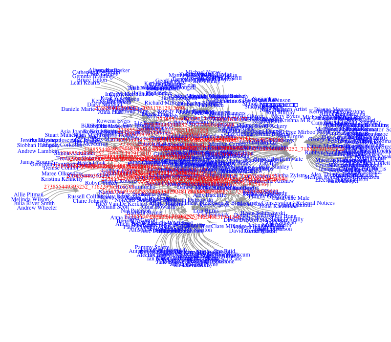

## Introduction

This is a tutorial for the *SocialMediaLab* R package. 

For more information, see [SocialMediaLab page on the VOSON website](http://vosonlab.net/SocialMediaLab).

- 可以搜集社群媒體資料並建立不同類別的網路分析模型
- 可以處理與建立非常大的網路，依據電腦的資源多寡，可以建立多達百萬甚至更多的網路
- 節點目前支援的社群媒體平台

1. Facebook
2. YouTube
3. Twitter


## Installation and setup

SocialMediaLab 是一個 R 的套件，所以我們需要先下載安裝並載入它，另外，這個教程還會用到 magrittr 來做資料流的處理，用到 igraph 來做網路分析，因此也要載入這兩個套件

```{r warning=FALSE, eval=FALSE}
if (!"SocialMediaLab" %in% installed.packages()) install.packages("SocialMediaLab")
require(SocialMediaLab)

if (!"magrittr" %in% installed.packages()) install.packages("magrittr")
require(magrittr)

if (!"igraph" %in% installed.packages()) install.packages("igraph")
require(igraph)
```

因為 SocialMediaLab 是透過 API 存取資料，不是用爬蟲技術抓資料，因此你需要到臉書的開發網站 http://developer.facebook.com 去申請一組 API access key (appID 和 appSecret)，才能使用 API，詳細教程請參考 [SocialMediaLab page on the VOSON website](http://vosonlab.net/SocialMediaLab).


Hint: 因為目前 RStudio 這個檔案所在的資料夾(目錄)可能不是你想要的資料夾，你可以用下面兩道指令查看或切換到你想要的資料夾中

```{r eval=FALSE}
getwd() # 取得目前的工作目錄
setwd("~/SocialMediaLab/tutorial/") # 切換目前的工作目錄
```

## Data collection
### Facebook

**SocialMediaLab 已經把使用者驗證、資料搜集和建立網路的三個步驟都包裝成 Authenticate(), Collect(), Create() 函數，這樣的可以簡化工作流程**

如果你已經在臉書的網站取得了 app ID 和 app Secret，請填到下方的 XXX 中後執行

```{r eval=FALSE}
appID <- "XXX"
appSecret <- "XXX"
```

We will collect **one month of activity from the [Stop Coal Seam Gas Blue Mountains](https://www.facebook.com/StopCoalSeamGasBlueMountains/)** Facebook fan page.

This will collect all the *posts* posted between the `rangeFrom` and `rangeTo` dates, including all *comments* and *likes*, and other associated data including usernames, timestamps for comments, etc. Note: the date format is YYYY-MM-DD.

We will be using this data to create a bimodal network. This graph object is bimodal because edges represent relationships between nodes of two different types. For example, in our bimodal Facebook network, nodes represent Facebook *users* or Facebook *posts*, and edges represent whether a user has commented or 'liked' a post. Edges are directed and weighted (e.g. if user i has commented n times on post j, then the weight of this directed edge equals n). 

**Facebook 的部分只支援建立 bimodal 和 dynamic 網路**

```{r eval=FALSE}
g_bimodal_facebook_csg <- Authenticate("Facebook", 
  appID = appID, appSecret = appSecret) %>% 
  SaveCredential("FBCredential.RDS") %>%
  Collect(pageName="StopCoalSeamGasBlueMountains", rangeFrom="2015-06-23", 
  rangeTo="2015-07-23", writeToFile=TRUE) %>% 
  Create("Bimodal")
```

你可以打開 RStudio 下面的 console，你會看到 `press any key to continue`，接著瀏覽器會打開，顯示通過驗證了，接著會自動進行資料擷取


下載回來的檔案會是這個名稱`2015-06-23_to_2015-07-23_StopCoalSeamGasBlueMountains_FacebookData.csv`，程式會自動載入，沒有載入的話才用這行
```{r eval=FALSE}
# make sure you change the filename!:
myCSG_data <- read.csv("2015-06-23_to_2015-07-23_StopCoalSeamGasBlueMountains_FacebookData.csv")
View(myCSG_data)
```


至此，經過 Authenticate(), Collect(), Create() 的過程，就已經把網路建構成一個 graph variable 放到 g_bimodal_facebook_csg 中，我們可以檢視一下這個變數的內容

```{r eval=FALSE}
g_bimodal_facebook_csg
```

修改一下圖的樣式，讓 node (可能代表著 Post)為紅色，Users 則是預設藍色

```{r eval=FALSE}
V(g_bimodal_facebook_csg)$color <- ifelse(V(g_bimodal_facebook_csg)$type == "Post", "red", "blue")
```

### 畫圖！

```{r eval=FALSE}
plot(g_bimodal_facebook_csg)
```

### 由於 RStudio 的 plot pane 太小了，所以我們採用另一個(用 X11/XQuartz 改善過後的) 顯示方式

```{r eval=FALSE}
x11()
plot(g_bimodal_facebook_csg)
```

### 將圖輸出成檔案
```{r eval=FALSE}
png("g_bimodal_facebook_csg.png", width=800, height=700)
plot(g_bimodal_facebook_csg,vertex.shape="none",edge.width=1.5,edge.curved = .5,edge.arrow.size=0.5,vertex.label.color=V(g_bimodal_facebook_csg)$color,asp=9/16,margin=-0.15)
dev.off()
```


### 也可以存成 graphml 格式，可以讓 Gephi 讀取

```{r eval=FALSE}
write.graph(g_bimodal_facebook_csg,
  "g_bimodal_facebook_csg.graphml",format="graphml")
```

This can be read back into R as follows (note: to do this, you may have to compile R with XML support):
```{r eval=FALSE}
g <- read.graph("g_bimodal_facebook_csg.graphml", format="graphml")
```

### Twitter

**Twitter 的部分目前支援三種不同型態的網路：actor(行為者網絡), bimodal, semantic network**

一樣我們必須到 Twitter 的開發者網站去取的 key

```{r eval=FALSE}
# REPLACE WITH YOUR API KEY
myapikey <- "xxxx" 
# REPLACE WITH YOUR API SECRET
myapisecret <- "xxxx" 
# REPLACE WITH YOUR ACCESS TOKEN
myaccesstoken <- "xxxx" 
# REPLACE WITH YOUR ACCESS TOKEN SECRET
myaccesstokensecret <- "xxxx"
```

While it is possible to create a network with one command, here we will `Collect()` the data, but not pipe it directly through to `Network()` straight away. This means we can reuse the data multiple times to create different kinds of networks for analysis.

We will collect 150 recent tweets that have used the #auspol hashtag. This is the dominant hashtag for Australian politics.

```{r eval=FALSE}
myTwitterData <- Authenticate("twitter", apiKey=myapikey, 
                          apiSecret=myapisecret,
                          accessToken=myaccesstoken, 
                          accessTokenSecret=myaccesstokensecret) %>%
Collect(searchTerm="#auspol", numTweets=150, 
        writeToFile=TRUE,verbose=TRUE)
```

Note: if you are getting the error `Error in check_twitter_oauth( )`, please find a [solution here](https://github.com/geoffjentry/twitteR/issues/90).

We can have a quick look at the data we just collected:

```{r eval=FALSE}
View(myTwitterData)
```

* (ORM 化的概念)，使 SocialMediaLab 知道 dataset 是一個 objec of class dataSource，這樣用 Create() 時傳入不同的參數就可以指定要產生的不同網路圖的 (很程式設計的觀念)

```{r eval=FALSE}
class(myTwitterData)
```

If you find that you are encountering errors possibly related to the text of the tweets, you can try converting the tweet text to UTF-8 character encoding:

```{r eval=FALSE}
myTwitterData$text <- iconv(myTwitterData$text, to = 'utf-8')
```

**Mac users only** may also wish to try the following if they are encountering errors that may be due to character encoding issues:

```{r eval=FALSE}
#myTwitterData$text <- iconv(myTwitterData$text, to = 'utf-8-mac')
```

### 呼叫 Create() 建立 actor network
Now, we will create an *actor* network. In this actor network, edges represent interactions between Twitter users. An interaction is defined as a 'mention' or 'reply' or 'retweet' from user i to user j, given 'tweet' m. In a nutshell, a Twitter actor network shows us who is interacting with who in relation to a particular hashtag or search term.

```{r eval=FALSE}
g_twitter_actor <- myTwitterData %>% Create("Actor")
```

We now have an *igraph* graph object, and can analyse it using the same techniques we used in the "Divided They Blog" exercise.

We can now examine the description of our network:

```{r eval=FALSE}
g_twitter_actor
```

### 畫圖
```{r eval=FALSE}
png("g_twitter_actor.png", width=800, height=700)
plot(g_twitter_actor,vertex.shape="none",edge.width=1.5,edge.curved = .5,edge.arrow.size=0.5,asp=9/16,margin=-0.15)
dev.off()
```

Finally, save the graph object as a graphml file:

```{r eval=FALSE}
write.graph(g_twitter_actor,
  "g_twitter_actor.graphml",format="graphml")
```


### YouTube

As with the other data sources, the first thing we do is set up the API credentials:

```{r eval=FALSE}
apiKey <- "xxxx"
```

Next, we specify which videos we want to collect data from, using a character vector specifying one or more YouTube video IDs. For example, if the video URL is 'https://www.youtube.com/watch?v=Xfo0hpVrtrs', then use `videoIDs="Xfo0hpVrtrs"`.

For this example, we will collect data from an Australian anti-fracking video featuring 70s pop star Leo Sayer (!):

```{r eval=FALSE}
videoIDs <- c("Xfo0hpVrtrs")
```

The workflow is fairly straightforward - we just pipe together the 'verb' functions. A couple of comments.

1. By default, all the available comments are collected. If desired, the `maxComments' argument can be used to limit the number of comments (but as noted in the documentation, this is not always perfect, due to the YouTube API specifications).

2. Often, we will wish to retain the comment text for further analysis. There are two approaches (as discussed previously). First option is to leave out `Create()` function from the pipeline, so we are just creating a dataframe object with our data (which we can later pipe through to `Create()` an actor network). The second option, which we use in this example, is to specify `writeToFile=TRUE`, so we write the data to disk before piping it through `Create()` the network.

```{r eval=FALSE}
g_youtube_actor <- Authenticate("youtube", apiKey= apiKey) %>%
  Collect(videoIDs = videoIDs, writeToFile=TRUE) %>%
  Create("Actor")
```

A description of the network:

```{r eval=FALSE}
g_youtube_actor
```

A plot of the network:

```{r eval=FALSE}
png("youtube_fracking.png", width=800, height=700)
plot(g_youtube_actor,edge.width=1.5,edge.curved=.5,edge.arrow.size=0.5)
dev.off()
```

Save the graph object as a graphml file:

```{r eval=FALSE}
write.graph(g_youtube_actor,
  "g_youtube_actor.graphml",format="graphml")
```

Read in the YouTube data that we saved to disk, for example:

```{r eval=FALSE}
# make sure you change the filename:
myYouTubeData <- read.csv("Jun_26_03_12_16_2017_AEST_YoutubeData.csv")
View(myYouTubeData)
```


