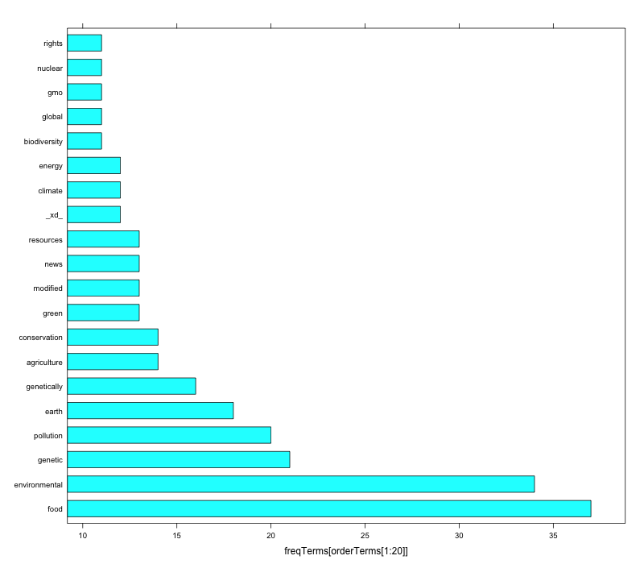
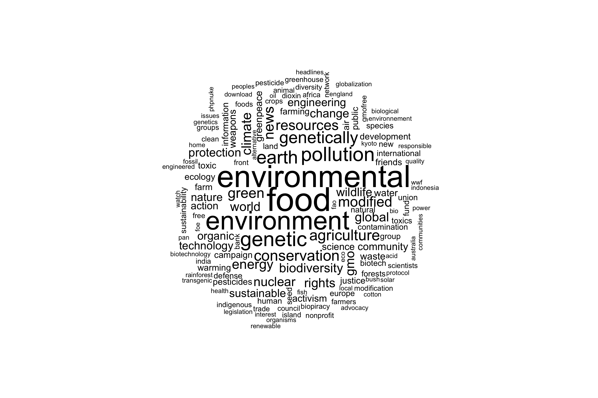
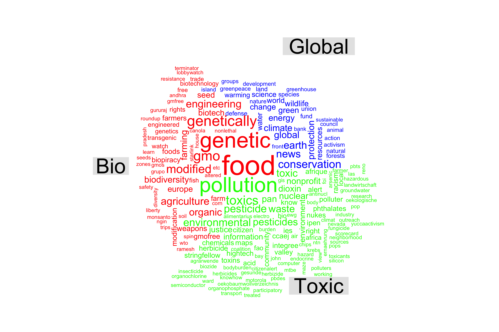

我們需要先下載安裝會用到的套件：

```{r warning=FALSE, eval=FALSE}
if (!"NLP" %in% installed.packages()) install.packages("NLP")
if (!"RColorBrewer" %in% installed.packages()) install.packages("RColorBrewer")

if (!"SnowballC" %in% installed.packages()) install.packages("SnowballC")

if (!"tm" %in% installed.packages()) install.packages("tm")
library(tm)        #this will also load SnowballC

if (!"lattice" %in% installed.packages()) install.packages("lattice")
library(lattice)

if (!"wordcloud" %in% installed.packages()) install.packages("wordcloud")
library(wordcloud)
```

This exercise uses a dataset from [Ackland, R. and M. O'Neil (2011), "Online collective identity: The case of the environmental movement," Social Networks, 33, 177-190].  The file "nano2seeds_v2.csv" contains website meta keywords for 161 environmental social movement organisations, collected in 2006. Note: not all the websites have meta keywords.  The websites are also coded according to SMO 'type': Globals (issues of concern include climate change, forest and wildlife preservation, nuclear weapons, and sustainable trade), Toxics (issues include pollutants and environmental justice) and Bios (issues include genetic engineering, organic farming and patenting). 

```{r eval=FALSE}
df <- read.csv("http://vosonlab.net/papers/Taiwan_2017/nano2seeds_v2.csv",stringsAsFactors=FALSE)
#df <- read.csv("nano2seeds_v2.csv",stringsAsFactors=FALSE)
```

# Part 1

點開我們下載回來的資料集後，會發現有不少列的 meta.keywords(說明欄) 這一欄是空的，因此先清除這些列
```{r eval=FALSE}
toRemove <- which(df$Meta.keywords=="")

if (isTRUE(length(toRemove)!=0)) {
    df <- df[-toRemove,]
}

nrow(df)                #81 websites have meta keywords
```

取出 dataset 的 meta.keywords 那一欄並指定為 keywords (character vector)

```{r eval=FALSE}
keywords <- df$Meta.keywords               #just for convenience
```

We convert the character encoding to UTF-8. This avoids errors relating to 'odd' characters in the text. This is usually a good idea, but there may be situations when it is not useful, or even detrimental. Note: Mac users may encounter errors/bugs relating to character encoding, and a workaround is to convert to 'utf-8-mac':

```{r eval=FALSE}
keywords <- iconv(keywords, to = 'utf-8')
# **MAC USERS ONLY** should use this instead:
keywords <- iconv(keywords,to="utf-8-mac")
```

建立操作用的物件

```{r eval=FALSE}
myCorpus <- VCorpus(VectorSource(keywords))  # myCorpus is a list of lists (JSON-like)
```

### 文字處理

透過 tm_map 可以一次對所有指定的資料作轉換操作

**將所有文字轉成小寫**:

```{r eval=FALSE}
myCorpus <- tm_map(myCorpus, content_transformer(tolower))
```

**移除數字**

```{r eval=FALSE}
myCorpus <- tm_map(myCorpus, removeNumbers)
```

**移除標點符號**

```{r eval=FALSE}
myCorpus <- tm_map(myCorpus, removePunctuation)
```

### Stemming

簡單來說：stemming 是 data pre-processing 的一種方法，例如 stemming("fisher", "fishing")，會得到 "fish"

Word stemming is the process of reducing words to their root or base form (see, for example, https://en.wikipedia.org/wiki/Stemming).  From the wikpedia page:

```
A stemming algorithm reduces the words "fishing", "fished", and "fisher" to the root word,
"fish". On the other hand, "argue", "argued", "argues", "arguing", and "argus" reduce to
the stem "argu" (illustrating the case where the stem is not itself a word or root) but
"argument" and "arguments" reduce to the stem "argument"."
```

Note that word stemming can be highly useful, but also highly detrimental!  For this exercise we in fact will not use it, and so will comment out the relevant syntax.

```{r eval=FALSE}
#myCorpus <- tm_map(myCorpus, stemDocument,lazy=TRUE) # use lazy=TRUE argument to avoid warning on some machines with multiple CPU cores
```

### Stop word removal
We can also remove English 'stop words' from the text. These are common words (e.g. 'the', 'and', 'or') that we may want to exclude from our analysis. Once again, this is highly useful but also needs to be carefully applied.

```{r eval=FALSE}
myCorpus <- tm_map(myCorpus, removeWords, stopwords("english"),lazy=TRUE) # use lazy=TRUE argument to avoid warning on some machines with multiple CPU cores
```

### White Space removal
**移除多餘的空白，例如字詞間只需要一個空白，多打的就不要了**

例如："hello    everyone my name   is    fred" => "hello everyone my name is fred":

```{r eval=FALSE}
myCorpus <- tm_map(myCorpus, stripWhitespace, lazy=TRUE)
```

We can observe the difference now by examining website #3 again:

```{r eval=FALSE}
myCorpus[[3]]$content
```

## defined own stop words

```{r eval=FALSE}
myStopwords <- c("environment")
myCorpus <- tm_map(myCorpus, removeWords, myStopwords)
```

### Create Document-Term Matrix (with a function!)
Next we create a document-term matrix (DTM) from the fbCorpus object. DTMs are a very important concept for text analysis and are highly useful. DTMs can be thought about as a table (i.e. matrix) where the rows are 'documents' (i.e. website meta keyword fields in our dataset), and the columns are 'terms' (i.e. each unique word found across all the documents in the dataset). **The 'cells' (i.e. elements) of the matrix indicate how many times term n occurred in document m**.

### DocumentTermMatrix(corpus) 會針對所有傳入的 doc 裡面每一個 terms 建立一個表，並且對應出不同文件中出現該 term 的次數，例如 doc1 中有一個 term 是 fox，則結果的表格中會有一個 fox 對應所有 docs 個字出現的次數

**這裡只是展示用，跟原例子無關**
```{r eval=FALSE}
#some test documents
myText <- c("the quick brown furry fox jumped over a second furry brown fox",
              "the sparse brown furry matrix",
              "the quick matrix")
#create the corpus
myVCorpus <- VCorpus(VectorSource(myText))
#create the DTM
myTdm <- DocumentTermMatrix(myVCorpus)
#display the DTM
as.matrix(myTdm)
#produces:
#    Terms
#Docs brown fox furry jumped matrix over quick second sparse the
#   1     2   2     2      1      0    1     1      1      0   1
#   2     1   0     1      0      1    0     0      0      1   1
#   3     0   0     0      0      1    0     1      0      0   1
```

**This is our sample**
note: we use the `control` argument to specify that we only want to **retain words that are minimum character length of 3, up to a maximum of 20 characters**.

```{r eval=FALSE}
dtm <- DocumentTermMatrix(myCorpus,control = list(wordLengths=c(3, 20)))
dtm
inspect(dtm[1:5, 20:30])
```

### 稀疏矩陣
**What we want to do is remove terms that occur very infrequently, which will leave us with the most 'important' terms**. We remove sparse terms using the `removeSparseTerms` function, which removes terms that occur equal to or less than a percentage threshold. 

**從上面的結果可以發現，會有很多的 0，這種矩陣稱為稀疏矩陣，在 Document Term Matrix 中這個意義是『sparse terms』，我們會希望找到在所有文件中出現比例較高的 term，它所代表的意義可能是這些文章討論的核心議題或主題，可以簡單呼叫 `removeSparseTerms` 來移除『出現在所有docs的比例』低於或等於我們設定的篩選門檻者**


**這裡只是展示用，跟原例子無關**
```{r eval=FALSE}
#the second argument to the removeSparseTerms() function is the threshold for which terms are to be retained
#in the following, only terms that appear in 99% or more documents are retained
as.matrix(removeSparseTerms(myTdm, .01))
#in the following, only terms that appear in 50% or more documents are retained 
as.matrix(removeSparseTerms(myTdm, .5))
```

**This is our sample (別急著問怎麼抓 0.95，下面作者說要 trial-and-error，而且最後會抓 0.98)**


```{r eval=FALSE}
ninetyFive <- removeSparseTerms(dtm, 0.95)
ninetyFive
#inspect(ninetyFive)
```


**You should use trial and error to establish how many terms to drop from the dtm** (note: you may decide to not drop any terms).  For our exercise we will set a threshold of 0.98. (at least 2% of docs)

```{r eval=FALSE}
dtmSparseRemoved <- removeSparseTerms(dtm, 0.98)
dtmSparseRemoved
#inspect(dtmSparseRemoved)
```

**過濾後各 terms 出現的文件總數**
**select terms, SUM(columns) group by columns**
```{r eval=FALSE}
freqTerms <- colSums(as.matrix(dtmSparseRemoved))
freqTerms
```

**找出出現文件數最多的前五與最少的前五個 terms**

```{r eval=FALSE}
orderTerms <- order(freqTerms,decreasing=TRUE)
freqTerms[head(orderTerms)]
freqTerms[tail(orderTerms)]
```

**找出至少出現20次的詞(不是出現在至少 20 篇文件)**
Which terms occurred at least 20 times?

```{r eval=FALSE}
findFreqTerms(dtmSparseRemoved, 20)
```

### 利用 findAssocs() 找兩個詞之間的關聯性，並篩選出關聯度至少 50%
**If two words always appear together in the same document then corr = 1**. If two terms never appear together then corr = 0. Let's look at which terms co-occur with the term "good", with a lower correlation limit of 0.5.

```{r eval=FALSE}
findAssocs(dtmSparseRemoved, "genetic", corlimit=0.5)
```

### 畫圖 (列出前 20 多的 terms)

```{r eval=FALSE}
png("barchart_frequent_terms.png", width=800, height=700)
barchart(freqTerms[orderTerms[1:20]])
dev.off()
```



# Part 2 文字雲

## Word Cloud
A *word cloud* is another way of visually representing frequencies of words in a corpus.  In the example below, we will first construct a word cloud for all of the websites in the dataset.  Then we will construct a word cloud for only the "bio" websites.  

### For all websites

**因為還會分成三種不同類別個字做分析，因此先把原本的 df 依照 Types 分三類 (以 Part1 的方法就是做成 character vectors)**
```{r eval=FALSE}
globalMeta <- df$Meta.keywords[which(df$Type=="Globals"&df$Meta.keywords!="")]
globalMeta <- paste(globalMeta, collapse = " ")

bioMeta <- df$Meta.keywords[which(df$Type=="Bios"&df$Meta.keywords!="")]
bioMeta <- paste(bioMeta, collapse = " ")

toxicMeta <- df$Meta.keywords[which(df$Type=="Toxics"&df$Meta.keywords!="")]
toxicMeta <- paste(toxicMeta, collapse = " ")
```

**至少會做一個不分類的文字雲，所以先集中成一個資料集**
```{r eval=FALSE}
df_ALL <- data.frame(group=c("Global","Bio","Toxic"),words=c(globalMeta,bioMeta,toxicMeta))
View(df_ALL)
```

Now, create a text corpus using similar approach to Part 1.

```{r eval=FALSE}
# we create a character vector from the "words" column of df_ALL
words <- df_ALL$words

# we will convert the character encoding to UTF-8
# just to be sure there are no odd characters that
# may cause problems later on
words <- iconv(words, to = 'UTF-8')
# ** MAC USERS ONLY **:
#words <- iconv(words, to = 'UTF-8-mac')

# using 'tm' package we convert character vector to a Vcorpus object (volatile corpus)
corp <- VCorpus(VectorSource(words))

## now we do transformations of text using tm_map ('mapping to the corpus')

# eliminate extra whitespace
corp <- tm_map(corp, stripWhitespace)

# convert to all lowercase
corp <- tm_map(corp, content_transformer(tolower))

# perform stemming (not always useful!)
#corp <- tm_map(corp, stemDocument)

# remove numbers (not always useful!)
corp <- tm_map(corp, removeNumbers)

# remove punctuation (not always useful! e.g. text emoticons)
corp <- tm_map(corp, removePunctuation)

# remove stop words (not always useful!)
corp <- tm_map(corp, removeWords, stopwords("english"))
```

### 畫圖 (呼叫 wordcloud() 即可！)

```{r eval=FALSE}
#note: if changing res of png, can't have dimensions in pixels (led to wordclouds with very few words...)
png("word_cloud_enviro_all.png", width=12, height=8, units="in", res=300)
wordcloud(corp,max.words=200,random.order=FALSE)
dev.off()
```



###For "bio" websites

```{r eval=FALSE}
bioMeta <- iconv(bioMeta, to = 'UTF-8')
# ** MAC USERS ONLY **:
#bioMeta <- iconv(bioMeta, to = 'UTF-8-mac')

bioCorp <- VCorpus(VectorSource(bioMeta))

bioCorp <- tm_map(bioCorp, stripWhitespace)

bioCorp <- tm_map(bioCorp, content_transformer(tolower))

#bioCorp <- tm_map(bioCorp, stemDocument)

bioCorp <- tm_map(bioCorp, removeNumbers)

bioCorp <- tm_map(bioCorp, removePunctuation)

bioCorp <- tm_map(bioCorp, removeWords, stopwords("english"))
```

We are now ready to create the word cloud.

```{r eval=FALSE}
#let's use differnt colour for text
colorsx=c("red")

png("word_cloud_enviro_bio.png", width=12, height=8, units="in", res=300)
wordcloud(bioCorp,max.words=200,random.order=FALSE,colors=colorsx)
dev.off()
```

##Comparison Cloud (把三種類型的文字雲組合在一朵雲的方法)
A *comparison cloud* is used to show the words that are being used by particular types of actors.

In Part 1, we created a document-term matrix (DTM) but here we will create the inverse of this matrix, the term-document matrix (TDM).

```{r eval=FALSE}
tdm <- TermDocumentMatrix(corp)
tdm
inspect(tdm[1:10,])

tdm2 <- as.matrix(tdm)            #convert to matrix

colnames(tdm2) <- c("Global","Bio","Toxic")
colorsx=c("blue","red","green")

png("comparison_cloud_enviro.png", width=12, height=8, units="in", res=300)
comparison.cloud(tdm2,max.words=200,random.order=FALSE,colors=colorsx)
#commonality.cloud(tdm2,random.order=FALSE)
dev.off()
```



